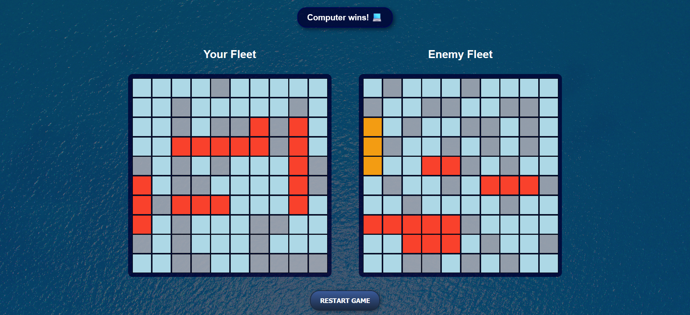

# BattleShip

A classic Battleship game built using HTML, CSS, and JavaScript, featuring an interactive UI and Jest for testing.

### Links

Live Site URL: [Enjoy Playing Battleship Here 🚢🔥](https://mainul-islam-nirob.github.io/BattleShip/dist)

### The Final Output

## Features

* **Single-player mode** against an AI opponent.
* **Turn-based gameplay** with hit/miss animations.
* **Winning and losing messages** displayed dynamically.
* **Modular code** for easy expansion and testing.
* **Unit tests** implemented using Jest.

## Technologies Used

* HTML, CSS, JavaScript
* Webpack for module bundling
* Jest for unit testing

## How to Play

1. Place your ships on the grid before starting the game.
2. Take turns selecting grid positions to attack.
3. The first player to sink all opponent ships wins.
4. Click on the Restart Game button to play again.

## Plan for Future Improvements

* **Make the bot smarter**
* **Enhance UI:**
  * Implement drag-and-drop functionality.
  * Add images for ships.
  * Display remaining and sunk ships for both players between the two boards.
  * Improve UI animations and effects.
  * Make responsive for Mobile device
* **Add sound effects:**
  * Implement shot sound effects and background Music.
* **Improve Webpack configuration.**
* **Refactor code where possible.**
* **Add more unit tests.**
* **Introduce multiplayer mode.**

---

## Author

- Facebook - [@mainul islam](https://web.facebook.com/mmmuinul.islam/)
- LinkedIn - [@mainul islam](https://www.linkedin.com/in/mainul-islam-nirob/)
- Twitter - [@mainul](https://twitter.com/Mainuli96601040)
- Github - [@mainul](https://github.com/Mainul-Islam-Nirob)

---

